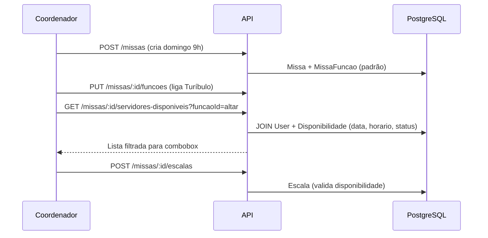

# API REST — EscalaAltar

Base URL: `/api`

Respostas de sucesso seguem `{ "data": ... }`. Erros: `{ "error": "CODE", "message": "..." }`.

**Documentação interativa:** [Swagger UI](http://localhost:3001/api/docs) · OpenAPI JSON: `/api/docs.json`

**Autenticação:** envie `Authorization: Bearer <token>` nas rotas protegidas (exceto login, register e health).

---

## Auth

### `POST /auth/login`

```json
{ "email": "servidor@email.com", "senha": "minhasenha" }
```

Resposta: `{ "token": "..." }` — os dados do usuário ficam no **payload do JWT** (`sub`, `email`, `nome`, `telefone`, `papel`). Para perfil atualizado use `GET /auth/me`.

### `POST /auth/register`

Cadastro público de **servidor** (`papel: SERVIDOR`).

```json
{ "email": "...", "senha": "minimo8chars", "nome": "João", "telefone": "..." }
```

### `GET /auth/me`

Perfil do usuário logado (requer JWT).

### `POST /auth/usuarios`

Coordenador ou Admin cria usuário com senha. Coordenador só cria `SERVIDOR`; Admin pode criar `COORDENADOR` e `ADMIN`.

```json
{
  "email": "coord@paroquia.local",
  "senha": "senhaforte123",
  "nome": "Maria Coord",
  "papel": "COORDENADOR"
}
```

---

## Health

### `GET /health`

Verificação de vida do serviço.

---

## Funções (catálogo)

### `GET /funcoes`

Lista funções litúrgicas ordenadas (`ordem`).

---

## Usuários

Requer JWT + papel `COORDENADOR` ou `ADMIN`.

### `GET /users?incluirInativos=true`

Lista servidores e coordenadores. Por padrão só `ativo: true`. Com `incluirInativos=true` traz também desativados.

### `GET /users/:userId`

Detalhe do usuário.

### `PATCH /users/:userId`

Desativa ou reativa usuário.

```json
{ "ativo": false }
```

| Quem faz        | Pode alterar              |
|-----------------|---------------------------|
| Coordenador     | Apenas `SERVIDOR`         |
| Admin           | `SERVIDOR` e `COORDENADOR`|
| Ninguém         | `ADMIN` ou a si mesmo     |

Usuário inativo não consegue login; continua no histórico de escalas.

---

## Disponibilidades (fluxo do servidor)

### `GET /disponibilidades?mesAno=YYYY-MM&userId={uuid}`

Lista marcações do usuário logado. Coordenador/Admin podem passar `userId` de outro servidor.

### `PUT /disponibilidades`

Salva disponibilidade em lote do **usuário logado** (upsert por data+horário).

**Body:**

```json
{
  "mesAno": "2025-06",
  "itens": [
    { "data": "2025-06-01", "horario": "H09", "status": "DISPONIVEL" },
    { "data": "2025-06-01", "horario": "H18", "status": "INDISPONIVEL" },
    { "data": "2025-06-08", "horario": "H09", "status": "DISPONIVEL" }
  ]
}
```

---

## Missas (fluxo do coordenador)

### `GET /missas?de=YYYY-MM-DD&ate=YYYY-MM-DD&tipo=DOMINICAL|ESPECIAL&ativa=true|false`

Lista missas no período.

### `POST /missas`

Cria missa. Funções padrão (`padrao=true`) são vinculadas se `funcaoIds` omitido.

**Body (dominical):**

```json
{
  "data": "2025-06-08",
  "horario": "H09",
  "tipo": "DOMINICAL"
}
```

**Body (especial):**

```json
{
  "titulo": "Quinta-feira Santa",
  "data": "2025-04-17",
  "horario": "H18",
  "tipo": "ESPECIAL",
  "funcaoIds": ["uuid-mc", "uuid-cruz"]
}
```

### `GET /missas/:missaId`

Detalhe: funções habilitadas + escala já montada.

### `PATCH /missas/:missaId`

Atualiza campos e/ou substitui conjunto de `funcaoIds`.

### `PUT /missas/:missaId/funcoes`

Define funções, quantidade de vagas e obrigatoriedade.

**Body:**

```json
{
  "funcoes": [
    { "funcaoId": "uuid-altar", "quantidade": 1, "obrigatoria": true },
    { "funcaoId": "uuid-ceroferario", "quantidade": 2, "obrigatoria": true },
    { "funcaoId": "uuid-turibulo", "quantidade": 1, "obrigatoria": false }
  ]
}
```

---

## Servidores disponíveis (combobox da escala)

### `GET /missas/:missaId/servidores-disponiveis`

**Endpoint principal** para montagem inteligente da escala.

Retorna usuários **ativos** que marcaram `DISPONIVEL` para a **data** e **horário** da missa, no mês civil correspondente.

Cada item inclui `funcoesNaMissa` — funções que o servidor **já ocupa** na mesma missa (acúmulo visível no UI).

**Resposta (exemplo):**

```json
{
  "data": {
    "missa": {
      "id": "…",
      "data": "2025-06-08T00:00:00.000Z",
      "horario": "H09",
      "titulo": null,
      "tipo": "DOMINICAL"
    },
    "mesAno": "2025-06",
    "total": 12,
    "servidores": [
      {
        "id": "…",
        "nome": "João Silva",
        "email": "joao@…",
        "telefone": null,
        "funcoesNaMissa": [
          { "funcaoId": "…", "codigo": "ALTAR", "nome": "Altar", "vaga": 1 }
        ]
      }
    ]
  }
}
```

### `GET /missas/:missaId/servidores-disponiveis?funcaoId={uuid}`

Mesma lista, com metadados da função (`quantidade`, `vagasRestantes`) e flags `jaEscaladoNestaFuncao` por servidor.

Use esta variante quando o combobox for **por função** na tela de edição da missa.

---

## Escala

### `GET /missas/:missaId/escalas?funcaoId={uuid}`

Lista atribuições. `funcaoId` opcional.

### `POST /missas/:missaId/escalas`

Atribui servidor. **Valida disponibilidade** antes de gravar.

**Body:**

```json
{
  "funcaoId": "uuid-microfone",
  "userId": "uuid-servidor",
  "vaga": 1
}
```

Erros comuns:

| Código                   | HTTP | Situação |
|--------------------------|------|----------|
| `SERVIDOR_INDISPONIVEL`  | 400  | Não marcou disponível no slot |
| `FUNCAO_NOT_ENABLED`     | 400  | Função desligada na missa |
| `VAGA_INVALID`           | 400  | `vaga` > `quantidade` |

### `DELETE /missas/:missaId/escalas/:escalaId`

Remove uma atribuição.

---

## Fluxo típico do coordenador



---

## Códigos de erro globais

| Código              | HTTP |
|---------------------|------|
| `VALIDATION_ERROR`  | 400  |
| `MISSA_NOT_FOUND`   | 404  |
| `USER_NOT_FOUND`    | 404  |
| `INTERNAL_ERROR`    | 500  |

Implementação: `src/services/` e `src/routes/`.
