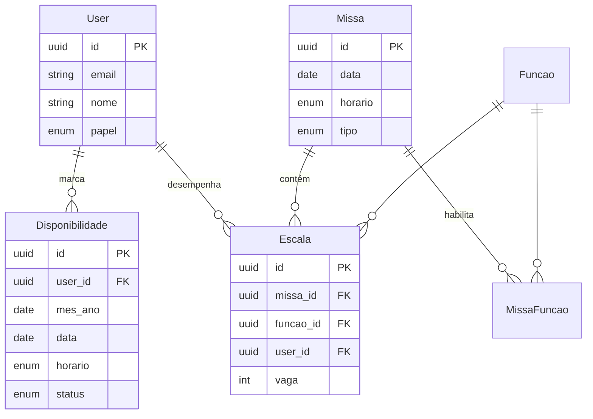

# Modelo de dados — EscalaAltar

Diagrama lógico das entidades e relacionamentos.

## Entidades

### `User`

Servidores e coordenadores. Autenticação com `password_hash` (bcrypt) e JWT no backend.

| Campo   | Descrição |
|---------|-----------|
| `password_hash` | Senha nunca retornada nas APIs |
| `papel` | `SERVIDOR`, `COORDENADOR`, `ADMIN` |
| `ativo` | Soft-disable sem apagar histórico |

### `Funcao`

Catálogo fixo (seed). `codigo` é estável para integrações (`ALTAR`, `MC`, …).  
`padrao=true` entra automaticamente em novas missas dominicais se o coordenador não enviar `funcaoIds`.

### `Missa`

Uma celebração em **data + horário** únicos (`@@unique([data, horario])`).

| `tipo`      | Uso |
|-------------|-----|
| `DOMINICAL` | Domingo 9h / 18h (padrão) |
| `ESPECIAL`  | Quinta-feira Santa, casamento, solenidade |

Missas especiais devem ter `titulo`.

### `MissaFuncao`

Funções **ativas** naquela missa (liga/desliga MC, Turíbulo, etc.).

| Campo         | Uso |
|---------------|-----|
| `quantidade`  | Vagas (ex.: 2 ceroferários) |
| `obrigatoria` | UI pode destacar funções essenciais |

### `Disponibilidade`

Fluxo mensal do **servidor**: no mês corrente preenche disponibilidade para o **mês seguinte** (`mesAno`).

| Campo    | Exemplo |
|----------|---------|
| `mesAno` | `2025-06-01` (representa junho/2025) |
| `data`   | `2025-06-08` (domingo) |
| `horario`| `H09` ou `H18` |
| `status` | `DISPONIVEL` / `INDISPONIVEL` |

Constraint: um registro por `(userId, mesAno, data, horario)`.

**Montagem inteligente da escala:** ao escalar a missa de `2025-06-08` às `H09`, a API busca usuários com:

- `disponibilidades.mesAno` = primeiro dia do mês da `missa.data`
- `disponibilidades.data` = `missa.data`
- `disponibilidades.horario` = `missa.horario`
- `status` = `DISPONIVEL`

### `Escala`

Quem exerce qual função em qual missa.

- **Acúmulo:** o mesmo `userId` pode aparecer em várias linhas com `funcaoId` diferentes.
- **Vagas:** `vaga` (1..N) alinha com `MissaFuncao.quantidade`.
- Unique: `(missaId, funcaoId, userId, vaga)`.

## Enums

| Enum                    | Valores |
|-------------------------|---------|
| `HorarioMissa`          | `H09`, `H18` |
| `TipoMissa`             | `DOMINICAL`, `ESPECIAL` |
| `StatusDisponibilidade` | `DISPONIVEL`, `INDISPONIVEL` |
| `PapelUsuario`          | `SERVIDOR`, `COORDENADOR`, `ADMIN` |

## Índices relevantes

- `disponibilidades (data, horario, status)` — filtro rápido do combobox
- `disponibilidades (mes_ano, user_id)` — painel mensal do servidor
- `missas (data, horario)` — calendário do coordenador

## Arquivo fonte

Definição completa: `prisma/schema.prisma`.
